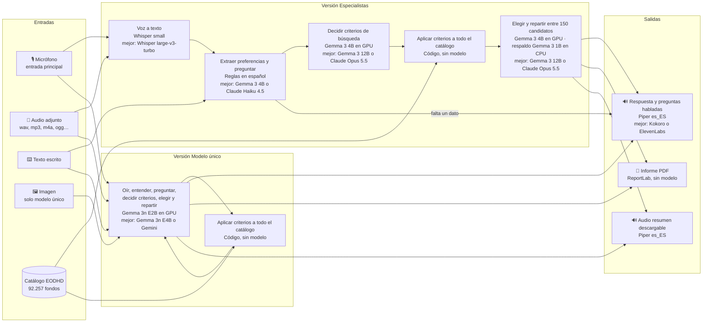
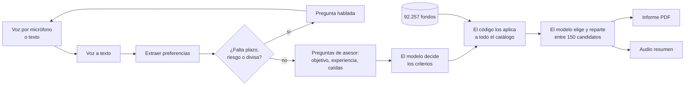

# FondoClaro · asesor de fondos por voz (MVP)

MVP del Taller B5-T4. El usuario **habla** con la página sobre lo que quiere invertir y la página le **responde con voz**. Si falta algún dato obligatorio, se lo pregunta. Al terminar entrega un **informe PDF** con la cartera de fondos propuesta y un **audio** que resume en qué le recomienda invertir. También se puede escribir en lugar de hablar.

Todo se ejecuta en local con modelos descargados de Hugging Face. No hace falta ninguna clave.

> Demostración educativa. No es asesoramiento de inversión, no sustituye un test de idoneidad y no verifica comisiones ni mínimos de suscripción. Las rentabilidades pasadas no garantizan rentabilidades futuras.

## Arranque tras clonar (Windows)

Necesitas [Python 3.11](https://www.python.org/downloads/).

1. Doble clic en **`instalar.bat`**. Crea el entorno, instala las dependencias y descarga los modelos básicos (1 GB). Funciona en cualquier equipo, sin GPU.
2. Doble clic en **`iniciar.bat`**. Arranca la aplicación y abre `index.html`, la puerta de entrada con los enlaces.

La aplicación queda en `http://localhost:8501`. Recién instalada usa 10 fondos sintéticos de ejemplo.

Opcional:

- **Modelos de GPU** (NVIDIA con 12 GB o más; descarga 19 GB): ejecuta `instalar.bat gpu` desde una terminal. Añade el filtro con Gemma 3 4B y la versión de modelo único.
- **Catálogo real** (no está en el repositorio): `.venv\Scripts\python scripts\import_catalog.py ruta\a\catalogo_fondos.md`.

A mano, sin los `.bat`:

```bash
py -3.11 -m venv .venv
.venv\Scripts\python -m pip install -r requirements.txt --only-binary=llama-cpp-python --extra-index-url https://abetlen.github.io/llama-cpp-python/whl/cpu
.venv\Scripts\python scripts\download_models.py
.venv\Scripts\python -m streamlit run app.py
```

En la página **Pruebas y estado** se ve qué está instalado y qué falta, y se pueden ejecutar las pruebas automáticas desde el navegador.

## Qué hay en la página

| Página | Qué es |
| --- | --- |
| 🧩 **Especialistas** | Un modelo adaptado a cada paso. En la barra lateral se elige quién selecciona los fondos: Gemma 3 4B en GPU, Gemma 3 1B en CPU, Claude por API o solo reglas (aparecen las opciones instaladas). |
| 🧠 **Modelo único** | Un solo modelo multimodal (Gemma 3n) recibe audio, texto o imagen y hace todo. Necesita GPU. |
| ✅ **Pruebas y estado** | Qué modelos y datos hay instalados, y las pruebas automáticas. |

Se conversa con el micrófono: pulsar, hablar y volver a pulsar para enviar. La respuesta suena sola. Con «⌨️ Escribir» se cambia a chat de texto, donde también se pueden adjuntar audios.

**Conversación de prueba:** «Quiero invertir 10.000 euros en fondos de tecnología, bien diversificado» → «A cinco años y con riesgo alto» → «Quiero hacer crecer el dinero, nunca he invertido y si cae vendería».

**Cambiar el aspecto:** `estilo.css` (burbujas, títulos) y `.streamlit/config.toml` (colores, tipografía, puerto). `index.html` es solo la portada con los enlaces; la aplicación es Python y no funciona abriendo un HTML sin arrancarla.

## Entradas, modelos y salidas

Cada cuadro indica, por este orden, el paso, el modelo instalado y el que creemos que funcionaría mejor (no probado aquí).



## Cómo funciona



1. **Conversación.** Son obligatorios el plazo (1, 3 o 5 años, los únicos con datos), el riesgo y la divisa. Lo que falte se pregunta por voz. Importe, zona, sector, clase de activo y grado de diversificación son opcionales.
2. **Preguntas de asesor.** Una vez, y se pueden saltar: objetivo (crecer, conservar, rentas), experiencia y reacción ante una caída del 20 %. Si las respuestas no sostienen el riesgo declarado, se baja un nivel y se explica.
3. **El modelo decide los criterios.** A partir de la conversación transcrita fija cuánto pesan el ajuste al riesgo, el Sharpe y la rentabilidad, la volatilidad objetivo, una rentabilidad mínima y, si el cliente pidió un tema («oro», «tecnología»), las palabras que deben aparecer en el nombre del fondo.
4. **El código los aplica a todo el catálogo.** Siempre se descartan los fondos de otra divisa, sin datos recientes o por encima de la volatilidad máxima del perfil (bajo 10 %, medio 20 %, alto 35 %): el modelo no puede subir el riesgo. Queda una sola clase de participación por fondo.
5. **El modelo elige y reparte.** Ve los 150 mejores candidatos con sus cifras y devuelve qué fondos y con qué peso. El número de fondos (2 a 7) depende de cuánto se quiera diversificar.
6. **Validación.** Solo se aceptan fondos de la lista; los repartos degenerados se sustituyen por uno inversamente proporcional a la volatilidad. Si el modelo falla, deciden las reglas.
7. **Entrega.** PDF con la conversación, el perfil, los criterios, la cartera, un gráfico y el porqué de cada fondo; y un audio con el resumen.

Los pasos 3 y 5 con 150 candidatos necesitan el filtro en GPU (o Claude). Con Gemma 3 1B en CPU no hay paso 3 y el modelo elige entre 10 candidatos.

### Límites que conviene conocer

- **Las cifras nunca salen del modelo.** Rentabilidades, volatilidades y motivos por fondo vienen del catálogo.
- **El modelo no lee los 92.257 fondos uno a uno.** No caben en su contexto: decide los criterios, el código los aplica a todos y el modelo elige entre los 150 mejores.
- **Zona y sector casi nunca están verificados.** Solo 3 fondos tienen ficha contrastada, así que las preferencias se comprueban con el nombre del fondo y el informe lo marca como «exposición no verificada».
- **No hay mínimos de suscripción en el catálogo.** Se consideran todos los fondos; por debajo de 100.000, entre las clases de un mismo fondo se prefiere la que no parece institucional. El mínimo real hay que mirarlo en el folleto.
- **Las exclusiones por sector no se pueden garantizar** sin la composición completa; la app lo dice y pregunta si sigue sin ellas.
- **El reparto no es una optimización de cartera completa:** no hay correlaciones entre fondos.
- **Los modelos locales no consultan internet.** Solo usan lo que se les pasa.
- **La conversación no es manos libres:** hay que pulsar el micrófono en cada turno.

## Comparación entre versiones

| | Especialistas | Modelo único |
| --- | --- | --- |
| Voz a texto | Whisper `small` | Gemma 3n E2B |
| Entender la petición | Reglas en español | Gemma 3n E2B |
| Qué preguntar | Preguntas fijas | Gemma 3n E2B las redacta |
| Criterios, elección y reparto | Gemma 3 4B | Gemma 3n E2B |
| Hablar | Piper | Piper (Gemma 3n no genera voz) |
| Memoria de GPU | 4 GB | 11 GB |

Las dos comparten catálogo, filtros, validación, PDF y voz, así que la diferencia que se observa es la de los modelos. Cada respuesta muestra los segundos que ha tardado. En la GPU solo hay un modelo cargado a la vez: al cambiar de versión, la primera respuesta tarda más.

**Primera comparación.** Es una sola conversación de tres turnos hablados, con audios generados por Piper y un micrófono simulado en el navegador; no es una evaluación.

- **Especialistas:** transcribió y extrajo bien los datos y entregó la propuesta en el tercer turno. Las preguntas tardan unos 3 s; la propuesta, 20–50 s (más la primera vez, al cargar el modelo).
- **Modelo único:** transcribió bien, pero no dedujo la divisa de «10.000 euros» y siguió preguntando, así que no llegó a la propuesta en tres turnos. Cada turno tarda unos 18 s. Sus preguntas suenan más naturales.

## Modelos candidatos por paso

En negrita, el instalado. Las alternativas no se han probado aquí.

| Paso | Instalado | Alternativa local | Alternativa en la nube |
| --- | --- | --- | --- |
| Voz a texto | **Whisper `small`** (CPU) | Whisper `large-v3-turbo`; NVIDIA Parakeet TDT v3 | `gpt-4o-transcribe` |
| Extraer preferencias | **Reglas en español** (sin modelo) | Gemma 3 4B; Qwen 2.5 7B | Claude Haiku 4.5; Gemini Flash |
| Criterios, elección y reparto | **Gemma 3 4B en 4 bits** (GPU, 4 GB) · respaldo **Gemma 3 1B Q4** (CPU) | Gemma 3 12B; Qwen 2.5 14B | Claude Opus 5.5 (preparado, deshabilitado) |
| Texto a voz | **Piper `es_ES-davefx-medium`** (CPU) | Kokoro; XTTS-v2 | ElevenLabs Multilingual; `gpt-4o-mini-tts` |
| Modelo único multimodal | **Gemma 3n E2B** (GPU, 11 GB) | Gemma 3n E4B; Phi-4 multimodal; Qwen2.5-Omni | Gemini; GPT-4o audio |
| Leer folletos y KID (no implementado) | — | Docling; Qwen2.5-VL | Claude con PDF |

Para cambiar Whisper: `WHISPER_MODEL=medium` en `.env` y volver a ejecutar `scripts/download_models.py`.

### Claude y consulta web (deshabilitado)

El filtro también puede hacerlo Claude por API. Está preparado pero **no se ha probado**, porque no hay clave configurada. Para activarlo: `pip install -r requirements-claude.txt`, copiar `.env.example` a `.env` y poner `ANTHROPIC_API_KEY`; entonces aparece «Claude por API» en la barra lateral. Con `ADVISOR_WEB=on` Claude puede además buscar en la web datos públicos de los candidatos (categoría, zona, comisiones). Consume tokens de pago y envía al proveedor la conversación y la lista de candidatos; `.env` está ignorado por Git.

## Estructura

```text
instalar.bat, iniciar.bat  Instalación y arranque con doble clic
index.html                 Portada con los enlaces a la aplicación
app.py                     Punto de entrada y navegación
paginas/                   Especialistas, Modelo único, Pruebas y estado
estilo.css, .streamlit/    Aspecto y configuración de la página
src/conversation.py        Diálogo: qué falta, qué preguntar, ajuste de riesgo
src/preferences.py         Reglas de extracción en español
src/audio.py               Voz a texto (Whisper)
src/tts.py                 Texto a voz (Piper)
src/recommender.py         Filtros, puntuación, clases de un mismo fondo
src/ai_filter.py           Criterios, selección y reparto con IA (Gemma o Claude)
src/omni.py                Lo mismo con Gemma 3n como único modelo
src/hf_model.py            Carga de modelos en la GPU, uno a la vez
src/report.py              Informe PDF y texto del resumen hablado
src/ui.py                  Piezas de interfaz comunes a las dos versiones
scripts/download_models.py Descarga de modelos desde Hugging Face
scripts/import_catalog.py  Conversión del Markdown EODHD a CSV
data/demo_funds.csv        Catálogo sintético
data/private/, models/     Catálogo real y modelos, ignorados por Git
tests/                     Pruebas (python -m unittest discover -s tests)
```

El dataset EODHD y sus derechos de uso no se incluyen en el repositorio; no lo publiques sin comprobar la licencia. Gemma se distribuye bajo los términos de uso de Google y Piper (`piper-tts`) bajo GPL-3.0.
