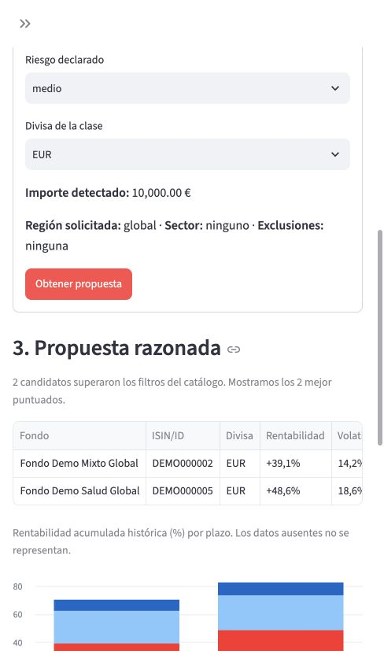
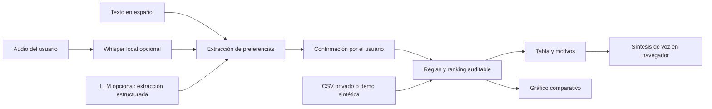

# FondoClaro · recomendador multimodal de fondos (MVP)

MVP del Taller B5-T4: el usuario describe en lenguaje natural su horizonte, tolerancia al riesgo, divisa y preferencias; el sistema devuelve una **preselección trazable** de fondos. Puede introducir texto o voz, comparar rendimientos mediante un gráfico y escuchar un resumen. El repositorio incluye un catálogo **sintético** para que la demo arranque sin claves ni descargas de datos financieros.

> Esta aplicación es una demostración educativa. No realiza un test de idoneidad, no verifica comisiones ni constituye asesoramiento de inversión. Los resultados históricos no garantizan rentabilidades futuras.

## Arranque en 3 pasos

Necesitas Python 3.11 o superior.

```bash
python3 -m venv .venv
source .venv/bin/activate
python -m pip install -r requirements.txt
streamlit run app.py
```

En Windows, activa el entorno con `.venv\Scripts\activate`. Streamlit muestra la URL local, normalmente `http://localhost:8501`. El flujo de texto funciona sin API ni credenciales.

**Petición de prueba:** «Quiero invertir 10.000 euros durante 5 años, con riesgo medio y un fondo global». Pulsa *Interpretar petición*, comprueba los campos extraídos y pulsa *Obtener propuesta*. Prueba también una petición sin plazo o sin riesgo: la interfaz exigirá que los completes, en lugar de inventarlos.

**Captura de la demo sintética:**



Los nombres, identificadores y cifras de la captura son ficticios. En la instalación local con el catálogo privado, la misma interfaz muestra resultados basados en los datos importados.

## Datos reales: integración con el catálogo EODHD del equipo

El dataset completo y sus derechos de uso no se incluyen en el repositorio público. La app puede leer el Markdown `catalogo_fondos.md` elaborado por el equipo, que contiene 92.257 identificadores y métricas a 1, 3 y 5 años. Para usarlo localmente:

```bash
python scripts/import_catalog.py /ruta/privada/catalogo_fondos.md
streamlit run app.py
```

El importador crea `data/private/funds.csv`, ignorado por Git. La app lo detecta automáticamente y sustituye el catálogo de muestra. Si falta el archivo, vuelve al modo sintético. **No publiques el dataset EODHD ni las claves API sin comprobar la licencia y las autorizaciones correspondientes.**

El catálogo privado contiene retornos acumulados, volatilidades anualizadas y ratios de Sharpe anualizados por ventana. El importador conserva valores no disponibles como celdas vacías. Regiones, sectores y estrategia solo se usan como filtros cuando hay una ficha externa enlazada; la mayoría de esos campos siguen sin verificar, por lo que una petición temática puede devolver cero candidatos. Una exclusión sectorial estricta requiere la composición completa y este MVP no la promete.

## Modalidades y arquitectura



| Componente | Responsabilidad | Requiere conexión |
| --- | --- | --- |
| `src/preferences.py` | Extraer parámetros explícitos con reglas locales; opcionalmente usar un LLM con salida estructurada. | Solo para el LLM opcional. |
| `src/audio.py` | Transcribir audio con Whisper local. | Solo la primera descarga del modelo. |
| `src/catalog.py` y `scripts/import_catalog.py` | Leer el CSV de demo o transformar el Markdown privado. | No. |
| `src/recommender.py` | Filtrar y puntuar con datos existentes; nunca completar exposiciones faltantes. | No. |
| `app.py` | Interfaz Streamlit, tabla, gráfico, descarga CSV y lectura de resumen con la voz del navegador. | No para el flujo básico. |

La etapa de voz a texto de los compañeros sigue disponible en `Multimodal_Cartera_Fondos.ipynb`. Sus dependencias independientes están en `requirements-notebook.txt`.

### Voz opcional

```bash
python -m pip install -r requirements-voice.txt
streamlit run app.py
```

Graba en el navegador o sube un WAV/MP3/M4A de hasta 25 MiB. La transcripción se realiza en el equipo con `faster-whisper` (modelo `base`, CPU/int8). La primera ejecución descarga el modelo y tarda más; revisa la transcripción antes de recomendar. La síntesis de voz usa `speechSynthesis` del navegador tras pulsar un botón y no se envía a un servidor de voz.

### Modelo de lenguaje opcional

```bash
python -m pip install -r requirements-ai.txt
export OPENAI_API_KEY='tu_clave_local'
streamlit run app.py
```

Activa la casilla de la interfaz. `gpt-4o-mini` extrae preferencias con salida estructurada y validación local; el modelo **no escoge los fondos**. Si falla o no hay clave, se utilizan reglas locales. La clave se lee del entorno y nunca se escribe en el repositorio. Puedes cambiar el modelo con `OPENAI_MODEL`, siempre que admita Structured Outputs. La API no se ha usado para generar los datos de la demo.

## Decisión explicable

1. Se exige un horizonte de 1, 3 o 5 años, riesgo declarado y divisa. Se pueden corregir antes del cálculo.
2. Se descartan clases de otra divisa, con datos incompletos o con última fecha a más de 30 días del corte. Se aplican límites de volatilidad históricos: bajo ≤10 %, medio ≤20 %, alto ≤35 %. Son umbrales de **prototipo**, no equivalen al SRI oficial.
3. Los filtros de región o sector solo aceptan información con URL de perfil asociada al ISIN. Una petición de exclusión sectorial no genera candidatos mientras no exista composición completa verificable.
4. Entre candidatos, la puntuación suma ajuste a volatilidad objetivo (55 %), Sharpe histórico (25 %) y rentabilidad anual equivalente (20 %). El Sharpe ausente **no se muestra como cero** y recibe una puntuación neutra conservadora en ese componente. Se muestra la razón y el dato usado en cada propuesta.
5. Se limitan retornos y volatilidades extremos para evitar que posibles errores de proveedor dominen la muestra. Esto es un control del prototipo, no una validación externa de precios.

La clasificación de EODHD `FUND` puede incluir ETF u otros productos y un ISIN puede ser una clase de participación. Las métricas se calculan sobre precios ajustados del proveedor, sin convertir divisas ni validar de forma individual dividendos, comisiones o valor liquidativo oficial. La app no construye una cartera óptima ni propone pesos.

## Viabilidad y privacidad

**Público y valor.** El primer usuario es un estudiante o asesor que necesita explorar un catálogo grande y explicar por qué un conjunto reducido coincide con una petición expresada en lenguaje cotidiano. El modelo B2B2C potencial sería una licencia para entidades que ya cuentan con controles de idoneidad; este prototipo aún no tiene esos controles.

**Coste y latencia.** El flujo de texto con reglas y ranking local no consume tokens ni llamadas de pago. Whisper requiere CPU y almacenamiento local; el tiempo depende del hardware y la duración del audio. Si se activa el LLM, el coste depende de los tokens de entrada/salida y de la [tarifa vigente](https://developers.openai.com/api/docs/pricing); solo se envía el texto de la petición, no el catálogo. Objetivo de UX: interpretación y ranking en pocos segundos con el catálogo ya cargado; la primera descarga de Whisper queda fuera de ese objetivo. Antes de desplegar se deben medir latencia y coste con el hardware y tráfico reales.

**Riesgo normativo.** Para una oferta comercial de recomendaciones personalizadas habría que revisar [MiFID II y las directrices de idoneidad de ESMA](https://www.esma.europa.eu/publications-and-data/interactive-single-rulebook/mifid-ii), las obligaciones de información de productos y el [RGPD](https://eur-lex.europa.eu/eli/reg/2016/679/oj). Este MVP no solicita datos bancarios, no guarda audios ni perfiles y no debe presentarse como asesor regulado. Una revisión jurídica y de seguridad sería necesaria antes de atender a clientes.

## Estructura del repositorio

```text
app.py                         Interfaz y experiencia multimodal
src/                           Extracción, catálogo, ranking y voz
scripts/import_catalog.py      Conversión privada del Markdown EODHD
data/demo_funds.csv            Ejemplo sintético integrado
data/private/                  Catálogo real local, ignorado por Git
tests/                         Pruebas de extracción, importación y ranking
docs/pitch.md                  Propuesta de valor y demo
docs/pitch_fondoclaro.pptx     Presentación técnica de 5 diapositivas
docs/images/demo_result.jpg    Captura del modo sintético
Multimodal_Cartera_Fondos.ipynb Primera etapa de voz de los compañeros
```

Ejecuta las comprobaciones con `python -m unittest discover -s tests -v`. La aplicación está preparada para demo local o grabación; el despliegue público debe esperar a resolver licencias, permisos y revisión de idoneidad.
