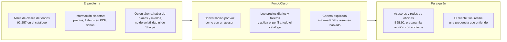
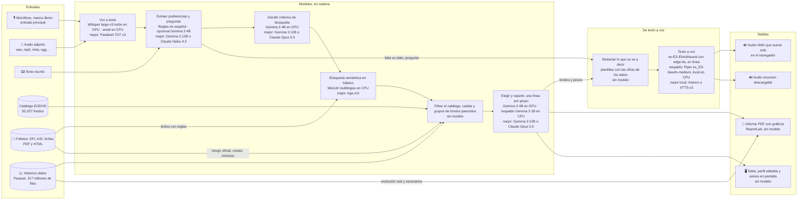
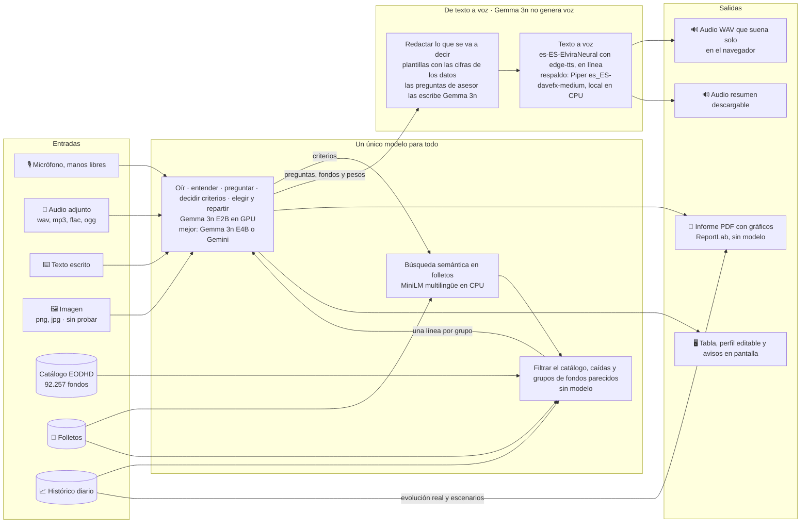
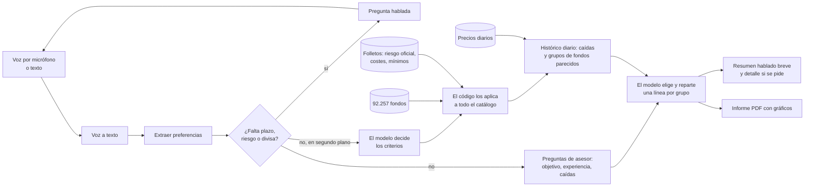

# FondoClaro · asesor de fondos por voz (MVP)

MVP del Taller B5-T4. El usuario **habla** con la página sobre lo que quiere invertir y la página le **responde con voz**. Si falta algún dato obligatorio, se lo pregunta. Al terminar entrega un **informe PDF** con la cartera de fondos propuesta y un **audio** que resume en qué le recomienda invertir. También se puede escribir en lugar de hablar.

Los modelos se descargan de Hugging Face y se ejecutan en local; no hace falta ninguna clave. La única parte que sale del equipo es la voz neuronal de las respuestas, que se puede desactivar (ver «Voz»).

> Demostración educativa. No es asesoramiento de inversión, no sustituye un test de idoneidad y no verifica comisiones ni mínimos de suscripción. Las rentabilidades pasadas no garantizan rentabilidades futuras.

**Vídeo de demostración:** [ejemplos_video/Video_ejemplo2.mp4](ejemplos_video/Video_ejemplo2.mp4), una conversación real por voz hasta la propuesta (81 MB; GitHub no lo reproduce en línea, hay que descargarlo).


Las capturas están hechas con el catálogo sintético de demostración (`CATALOG=demo`): los fondos y sus cifras son ficticios.

## El problema, para quién y por qué multimodal



- **Problema.** Elegir fondos exige traducir una necesidad cotidiana («tengo 20.000 euros para diez años y no quiero sustos») a filtros técnicos, y cruzar datos que están en formatos distintos: series de precios, folletos en PDF, fichas comerciales.
- **Público objetivo: B2B2C.** El usuario es el asesor o el gestor de una entidad que ya tiene autorización y controles de idoneidad; el beneficiario es su cliente. No se plantea como servicio directo al público (ver «Normativa»).
- **Qué aporta la multimodalidad.** La voz elimina el formulario: quien no sabe qué es la volatilidad puede explicar lo que quiere y contestar preguntas. Los documentos (DFI, KID, fichas) aportan lo que no está en los precios: riesgo oficial, costes y mínimos. Las series temporales dicen cómo se mueven los fondos entre sí. Y la salida vuelve a ser multimodal: una explicación hablada para el momento y un PDF con gráficos para decidir después.

## Viabilidad

**Coste de inferencia.** Todos los modelos corren en local, así que no hay coste por petición: el coste es el equipo (una GPU de 12 GB para la versión completa) y la electricidad. Como referencia para un despliegue por API, la propuesta consume unos 6.600 tokens de entrada y 300 de salida (medido: lista de 150 candidatos más criterios). A precios de lista de Anthropic consultados el 25/09/2026, eso son unos 0,03 USD por propuesta con Claude Opus 5.5 y menos de 0,01 USD con Claude Haiku 4.5. No hemos comprobado precios de transcripción ni de voz de otros proveedores.

**Latencia medida** (RTX 5080, modelos ya cargados):

| Paso | Tiempo |
| --- | --- |
| Transcribir un turno | 0,1 s en GPU (Whisper large-v3-turbo); alrededor de 1 s en CPU (Whisper small) |
| Entender y preguntar (reglas) | menos de 1 s, más 1–2 s de voz |
| Decidir criterios (Gemma 3 4B) | unos 10 s |
| Filtrar el catálogo, búsqueda semántica e histórico diario de hasta 2.000 candidatos | 4–6 s |
| Elegir y repartir (Gemma 3 4B) | unos 8 s |
| Informe y voz del resumen | 3–5 s |
| **Propuesta completa, hecha de una vez** | **20–35 s** |
| **Propuesta tras conversar por voz** (lo adelantado en segundo plano) | **unos 11 s** |

Una conversación de tres turnos por voz tarda en total unos 80 s. En cuanto se conocen plazo, riesgo y divisa, un hilo en segundo plano decide los criterios, filtra el catálogo y lee el histórico mientras la página hace las preguntas de asesor; cuando el cliente contesta solo queda elegir. Si responde de inmediato (por escrito), la espera vuelve a ser de unos 20 s. Sin GPU el modelo es más pequeño y ve menos candidatos, a costa de calidad.

**Normativa.** Proponer una cartera con pesos a una persona concreta es asesoramiento en materia de inversión: en España solo puede prestarlo una entidad autorizada, con test de idoneidad (MiFID II) y entrega del documento de datos fundamentales de cada producto (PRIIPs). Este MVP pregunta por objetivo, experiencia y tolerancia a pérdidas y baja el riesgo si no cuadran, pero eso no es un test de idoneidad. Por eso el modelo de negocio es B2B2C. La voz es un dato personal (RGPD): el audio se transcribe en local y no se guarda; la voz neuronal de las respuestas envía a un tercero el texto de la respuesta, no la voz del cliente, y se puede desactivar. El catálogo EODHD tiene licencia y no está en el repositorio.

**Monetización.** Licencia por puesto de asesor o por oficina, instalada en la infraestructura de la entidad (los datos del cliente no salen de ella). El valor que se cobra es tiempo de preparación de la reunión y trazabilidad de la propuesta. No hemos validado precios ni disposición a pagar.

## Requisitos

| | Instalación básica (`instalar.bat`) | Con modelos de GPU (`instalar_parte2_opcional.bat`) |
| --- | --- | --- |
| Sistema | Windows 10 u 11 de 64 bits | El mismo |
| Python | 3.11, con el lanzador `py` (viene con el instalador de python.org) | El mismo |
| Procesador y memoria (orientativo, no medido) | Cualquier CPU reciente; 8 GB de RAM | 16 GB de RAM |
| Tarjeta gráfica | No hace falta | NVIDIA con 12 GB de memoria o más y controlador reciente (se instala PyTorch para CUDA 12.8) |
| Disco | 2 GB (entorno 0,7 GB y modelos 1,3 GB) | unos 26 GB más (PyTorch con CUDA, 5 GB, y 21 GB de modelos) |
| Internet | Para instalar y para la primera vez que se procesan los folletos (descarga el modelo de embeddings); después solo para la voz neuronal | Para instalar |
| Navegador | Chrome o Edge recientes, con permiso de micrófono | El mismo |
| Datos | `catalogo_fondos.md` y, opcionalmente, la carpeta `folletos/` y `fondos_diarios.parquet` (no están en el repositorio); sin catálogo se usan 10 fondos de ejemplo | Los mismos |

Con la instalación básica funciona toda la conversación por voz, el informe y el audio; la voz se transcribe con Whisper `small` y los fondos los elige Gemma 3 1B en CPU entre 10 líneas, sin el paso de criterios. La parte 2 añade Whisper `large-v3-turbo` en GPU, el modelo que decide los criterios y elige entre 150 líneas (Gemma 3 4B) y la página «Modelo único» (Gemma 3n).

## Arranque tras clonar (Windows)

1. Copia a la carpeta del proyecto `catalogo_fondos.md` y, si los tienes, la carpeta `folletos/` y `fondos_diarios.parquet` (ninguno está en el repositorio). También se encuentran solos si están en una carpeta `datos` junto al proyecto. Sin el catálogo se usan 10 fondos sintéticos de ejemplo.
2. Doble clic en **`instalar.bat`**. Crea el entorno, instala las dependencias, descarga los modelos básicos (1,3 GB), importa el catálogo y procesa los folletos si los encuentra (la primera vez, unos minutos más para el índice de búsqueda semántica). Funciona en cualquier equipo, sin GPU.
3. Doble clic en **`iniciar.bat`**. Arranca la aplicación y abre `index.html`, la puerta de entrada con los enlaces.
4. Opcional, solo con una NVIDIA de 12 GB o más: doble clic en **`instalar_parte2_opcional.bat`**. Instala PyTorch con CUDA y descarga 21 GB de modelos. Añade Whisper `large-v3-turbo`, el filtro con Gemma 3 4B y la versión de modelo único.

La aplicación queda en `http://localhost:8501`. Clona el proyecto en una ruta corta (por ejemplo `C:\proyectos\`): en rutas muy largas la instalación falla por el límite de Windows.

Para importar el catálogo más tarde: `.venv\Scripts\python scripts\import_catalog.py ruta\a\catalogo_fondos.md`.

A mano, sin los `.bat`:

```bash
py -3.11 -m venv .venv
.venv\Scripts\python -m pip install -r requirements.txt --only-binary=llama-cpp-python --extra-index-url https://abetlen.github.io/llama-cpp-python/whl/cpu
.venv\Scripts\python scripts\download_models.py
.venv\Scripts\python -m streamlit run app.py
```

En la página **Pruebas y estado** se ve qué está instalado y qué falta, y se pueden ejecutar las pruebas automáticas desde el navegador.

## Qué hay en la página

| Página | Qué es |
| --- | --- |
| 🧩 **Especialistas** | Un modelo adaptado a cada paso. En la barra lateral se elige quién selecciona los fondos (Gemma 3 4B en GPU, Gemma 3 1B en CPU, Claude por API o solo reglas; aparecen las opciones instaladas) y quién entiende lo que dices (reglas, o reglas más el modelo de lenguaje). |
| 🧠 **Modelo único** | Un solo modelo multimodal (Gemma 3n) recibe audio, texto o imagen y hace todo. Necesita GPU. |
| ✅ **Pruebas y estado** | Qué modelos y datos hay instalados, y las pruebas automáticas. |

Hay tres formas de conversar, que se eligen encima del micrófono:

- **🎧 Manos libres** (por defecto): se pulsa «Empezar conversación» una vez. La página habla, escucha hasta que te callas, envía sola y vuelve a escuchar cuando termina de responder. No oye mientras habla, así que no se la puede interrumpir.
- **🎙️ Pulsar para hablar:** pulsar, hablar y volver a pulsar para enviar.
- **⌨️ Escribir:** chat de texto, donde también se pueden adjuntar audios.

En la barra lateral, «Perfil interpretado (editable)» muestra lo que la página ha entendido y permite corregirlo a mano; al aplicar los cambios se recalcula la propuesta. Cada versión conserva su propia conversación al pasar de una a otra. Si la voz o el PDF fallan, la propuesta se muestra igualmente en pantalla.

**Voz.** Las respuestas usan una voz neuronal en línea (`es-ES-ElviraNeural`, a través del paquete `edge-tts`), más natural que la local. Envía el texto de cada respuesta al servicio de voz de Microsoft y no es una API oficial. Con `VOICE=local` en `.env`, o sin conexión, se usa Piper y nada sale del equipo.

**Entender lo que dices.** Por defecto lo hacen unas reglas en español, instantáneas. Con «Reglas + modelo de lenguaje», Gemma 3 4B lee además cada frase. En una prueba con ocho frases coloquiales el modelo captó cosas que las reglas no («bolsa americana», importes en letra), pero tardó 8–13 s por turno, se equivocó en algún dato y rellenó rasgos que nadie había dicho; por eso solo se le toman plazo, riesgo, divisa, importe, zona y sector, y las reglas tienen la última palabra.

**Conversación de prueba:** «Quiero invertir 10.000 euros en fondos de tecnología, bien diversificado» → «A cinco años y con riesgo alto» → «Quiero hacer crecer el dinero, nunca he invertido y si cae vendería».

**Cambiar el aspecto:** `estilo.css` (burbujas, títulos) y `.streamlit/config.toml` (colores, tipografía, puerto). `index.html` es solo la portada con los enlaces; la aplicación es Python y no funciona abriendo un HTML sin arrancarla.

## Entradas, modelos y salidas

Hay un diagrama por versión. Cada cuadro de modelo indica, por este orden, el paso, el modelo instalado y el que creemos que funcionaría mejor (no probado aquí). Los cuadros «sin modelo» son código.

### Versión Especialistas: un modelo adaptado a cada paso



### Versión Modelo único: un solo modelo multimodal



### Cómo se crea la voz

1. **El texto lo escribe el código, no un modelo.** Las preguntas («¿durante cuántos años…?») y el resumen final son plantillas que se rellenan con las cifras de los datos: número de fondos, rentabilidad y caída de la cartera, lo que ganó un fondo comparable. Así lo que se oye no puede contener una cifra inventada. La única excepción es la versión de modelo único, donde Gemma 3n redacta las preguntas de asesor.
2. **Un modelo de texto a voz lo convierte en audio.** Por defecto, la voz neuronal `es-ES-ElviraNeural`, a la que se llama por internet con el paquete `edge-tts` (servicio de voz de Microsoft, no oficial): se le envía el texto y devuelve un MP3, que se convierte a WAV. Si no hay conexión, el paquete no está o se pone `VOICE=local`, lo hace Piper con la voz `es_ES-davefx-medium`, un modelo pequeño que corre en la CPU del equipo.
3. **El navegador lo reproduce.** En manos libres suena solo y, al acabar, el micrófono vuelve a escuchar. El resumen final se puede además descargar.

La frase que el modelo de lenguaje escribe sobre la cartera aparece en el PDF, no se lee en voz alta. El código está en `src/tts.py`.

Las dos versiones comparten datos, filtros, validación, voz de respuesta e informe. Lo que cambia es quién oye, entiende, pregunta y decide: cuatro piezas especializadas en una, un solo modelo en la otra.

## Cómo funciona



1. **Conversación.** Son obligatorios el plazo (de 1 a 30 años), el riesgo y la divisa. Los fondos se comparan con las cifras del catálogo a 1, 3 o 5 años, la ventana más cercana al plazo; el comportamiento de la cartera se calcula con el histórico diario de todo el plazo que exista. Lo que falte se pregunta por voz. Importe, zona, sector, clase de activo y grado de diversificación son opcionales.
2. **Preguntas de asesor.** Una vez, y se pueden saltar: objetivo (crecer, conservar, rentas), experiencia y reacción ante una caída del 20 %. Si las respuestas no sostienen el riesgo declarado, se baja un nivel y se explica.
3. **El modelo decide los criterios.** A partir de la conversación transcrita fija cuánto pesan el ajuste al riesgo, el Sharpe y la rentabilidad, la volatilidad objetivo, una rentabilidad mínima y, si el cliente pidió un tema («oro», «tecnología»), las palabras que deben aparecer en el nombre del fondo. Las palabras genéricas («fondo», «crecimiento», «diversificado») se descartan, y los fondos cuyo folleto es afín al tema pasan ese filtro aunque no lleven la palabra en el nombre.
4. **El código los aplica a todo el catálogo.** Siempre se descartan los fondos de otra divisa, sin datos recientes o por encima de la volatilidad máxima del perfil (bajo 10 %, medio 20 %, alto 35 %): el modelo no puede subir el riesgo. Una ficha verificada que contradiga la preferencia no se sustituye por una coincidencia en el nombre. Se agrupan las posibles clases de participación por nombre, conservando números de índices y términos de cobertura; esta agrupación es aproximada.
5. **El modelo elige y reparte.** Tras los filtros quedan hasta 2.000 candidatos. Con el histórico diario se agrupan los que se mueven muy parecido (correlación semanal superior a 0,9) y el modelo lee una línea por grupo, la del mejor fondo, con su caída máxima; las caídas mayores de lo que tolera el perfil (10 %, 25 % y 45 %; un 30 % menos si el cliente dijo que vendería) restan puntuación: 150 líneas representan a muchos más fondos (1.600 en una prueba sin tema concreto). Si la conversación da tiempo, el modelo criba además los grupos siguientes por lotes de 100 y sus elegidos entran en la lista final. Devuelve qué fondos y con qué peso. Se respeta un número concreto solicitado de 1 a 7 fondos; «un solo fondo» recibe el 100 %. Si no se indica, se eligen entre 2 y 7 según la diversificación. Sin el histórico diario, el modelo lee los 150 mejores candidatos.
6. **Validación.** Solo se aceptan fondos de la lista y pesos numéricos finitos. Tanto el modelo como las reglas respetan un mínimo del 5 % y un máximo del 60 % por fondo (80 % si hay dos; 100 % si solo hay uno). Si el modelo falla o su reparto no es válido, deciden las reglas, que además no eligen dos fondos del mismo grupo. Sin histórico diario reparten por inversa de la volatilidad, o dan más peso a los fondos que mejor encajan si el objetivo es crecer.
7. **Segunda mirada con el histórico diario.** Si dos fondos elegidos se mueven casi igual (correlación semanal superior a 0,95), el peor colocado se sustituye por el siguiente candidato. Cuando deciden las reglas y hay histórico, el reparto es por paridad de riesgo con las correlaciones reales.
8. **Entrega.** La página resume la cartera de viva voz en menos de un minuto, en lenguaje llano y sin nombres ni pesos: cuántos fondos, de qué tipo, cuánto habría ganado y cuánto llegó a caer en conjunto. Lo pone en contexto: dice cuánto ganó un fondo comparable típico y, si los elegidos están entre los que mejor lo hicieron, avisa de que no hay que contar con que se repita. Después pregunta si se quiere el detalle y, solo entonces, lee fondo a fondo. En pantalla y en el PDF están siempre la conversación, el perfil, los criterios, la cartera y el porqué de cada fondo, con el porcentaje de fondos comparables al que superó; la evolución real que habría tenido la cartera, con su volatilidad y su caída máxima; y, en otro gráfico, tres escenarios para el plazo pedido: su peor año, un fondo comparable típico y su mejor año. Los importes se asignan a céntimos conservando el total y los límites de concentración.

Se reconocen importes en EUR, USD, GBP y CHF, con cifras o expresados en español («diez mil euros», «10.000 dólares», «ciento veinte euros con cincuenta céntimos»). Los importes negativos, nulos o no interpretables que se detecten requieren aclaración; no se transforman en cantidades positivas. Cuando se pregunta por el importe, se puede contestar solo con la cantidad. El importe sigue siendo opcional si no se ha indicado.

El paso 3 y las 150 líneas del paso 5 necesitan el filtro en GPU (o Claude). Con Gemma 3 1B en CPU no hay paso 3 y el modelo elige entre 10 líneas.

### Límites que conviene conocer

- **Las cifras nunca salen del modelo.** Rentabilidades, volatilidades y motivos por fondo vienen del catálogo, de los folletos y del histórico diario.
- **El modelo no lee los 92.257 fondos uno a uno.** No caben en su contexto: decide los criterios, el código los aplica a todos y el modelo elige entre una línea por grupo de fondos parecidos. La página dice cuántos fondos ha tenido en cuenta. La criba por lotes solo ocurre si la conversación deja tiempo; en una charla de tres turnos no llega a empezar.
- **Zona y sector solo están verificados donde hay folleto.** Para el resto, las preferencias se comprueban con el nombre del fondo y el informe lo marca como «exposición no verificada».
- **La inversión mínima solo se conoce donde hay ficha** (unos 1.700 fondos); esos se descartan si el mínimo supera el importe. Para el resto, por debajo de 100.000 se prefiere, entre las clases de un mismo fondo, la que no parece institucional; el mínimo real hay que mirarlo en el folleto.
- **Las exclusiones por sector no se pueden garantizar** sin la composición completa; la app lo dice y pregunta si sigue sin ellas.
- **El reparto no es una optimización de cartera completa.** Con el histórico diario se usan correlaciones para evitar duplicados y para la paridad de riesgo, pero no hay objetivo de rentabilidad esperada ni frontera eficiente.
- **La selección mira al pasado.** El modelo tiende a elegir los fondos que más subieron: en una prueba con riesgo alto propuso cinco fondos que habían superado a más del 97 % de los 30.768 comparables, cuando la mediana de estos fue del +11,8 % en cinco años. El informe y el resumen lo dicen expresamente, pero la selección en sí no se ha corregido.
- **Los escenarios son una ilustración, no una previsión.** Repetir todos los años el peor o el mejor es muy improbable. El escenario central usa lo que ganó un fondo comparable típico, no el año mediano de la cartera.
- **Los plazos largos se comparan con cifras a 5 años.** El catálogo no trae rentabilidad, volatilidad ni Sharpe a 10 años. Del histórico diario salen las caídas, los grupos y el comportamiento de la cartera, no esas tres cifras.
- **Los modelos locales no consultan internet.** Solo usan lo que se les pasa.
- **En manos libres no se puede interrumpir a la página:** solo escucha cuando ha terminado de hablar.

## Folletos de los fondos

`scripts/procesar_folletos.py` convierte la documentación descargada (carpeta `folletos/` con su `indice.csv`) en una fila por fondo, en `data/private/folletos.csv`:

| Documento | Qué se extrae |
| --- | --- |
| DFI de la CNMV y KID (PRIIPs) | Riesgo oficial de 1 a 7, periodo recomendado, costes corrientes, categoría y objetivo |
| Ficha de Deutsche Bank | Inversión mínima, divisa y gastos corrientes |
| Folleto resumido de la SEC (497K) | Objetivo y gastos anuales |

Zona, sector y clase de activo se deducen del objetivo con palabras clave. Se hace con reglas, sin modelo: son miles de documentos y tarda alrededor de un minuto. En la primera pasada (17.000 documentos de 19.128 fondos) se obtuvo el riesgo oficial de 2.406 fondos, los costes de 14.419 y la inversión mínima de 1.686.

Cómo se usa en la recomendación:

- **Riesgo oficial:** se descarta el fondo si su clase de riesgo supera la del perfil (bajo hasta 3, medio hasta 4, alto hasta 6), aunque su volatilidad pasada quepa.
- **Inversión mínima:** se descarta si supera el importe que se quiere invertir.
- **Costes:** restan puntuación y se muestran al modelo, que los tiene en cuenta al elegir.
- **Zona, sector y activos:** lo que dice el folleto cuenta como exposición verificada.
- **Fondos que solo están en los folletos:** no tienen precios en el catálogo, así que no se pueden puntuar. Los que encajan por divisa, riesgo oficial y preferencias se listan aparte en la página y en el PDF.

La descarga sigue creciendo: el script solo lee los fondos nuevos o con documentos nuevos, e `iniciar.bat` lo ejecuta en cada arranque.

**Búsqueda semántica.** Al procesar los folletos se calcula un vector del objetivo de cada fondo con un modelo de embeddings multilingüe pequeño, en CPU (unos 5 minutos la primera vez para 17.467 fondos; después solo los nuevos). Cuando el cliente pide un tema, se buscan los fondos cuyo objetivo se le parece aunque la palabra no esté en el nombre ni el folleto esté en español: «oro y metales preciosos» encuentra fondos de «gold». Esos fondos pasan el filtro de palabras que fija el modelo y reciben un pequeño extra de puntuación. Los filtros fijos de zona, sector y clase de activo no cambian.

Los folletos no se leen con un modelo de lenguaje ni con OCR: un documento escaneado o con una redacción distinta de la habitual se queda sin datos.

## Histórico diario de precios

La app usa `fondos_diarios.parquet` (317 millones de filas, 5,3 GB, no incluido en el repositorio) si está en la carpeta del proyecto, en `data/private`, en `..\datos` o en la ruta de la variable `DAILY_PARQUET`. Solo lee los fondos que necesita:

- **Antes de elegir:** los precios semanales de hasta 2.000 candidatos (3–5 s). De ahí salen la caída máxima de cada fondo, que cuenta en el ranking, y los grupos de fondos que se mueven muy parecido, que permiten al modelo leer una línea por grupo.
- **Después de elegir:** sustituye fondos casi idénticos, reparte por paridad de riesgo cuando deciden las reglas y calcula la evolución real, la volatilidad conjunta, la caída máxima y los escenarios del informe.

Sin el Parquet, el modelo lee los 150 mejores candidatos y el informe muestra la simulación ilustrativa.

Los fondos que solo tienen folleto siguen sin poder puntuarse: el Parquet contiene los mismos fondos que el catálogo.

## Comparación entre versiones

| | Especialistas | Modelo único |
| --- | --- | --- |
| Voz a texto | Whisper `large-v3-turbo` (GPU) o `small` (CPU) | Gemma 3n E2B |
| Entender la petición | Reglas en español (Gemma 3 4B opcional) | Gemma 3n E2B |
| Qué preguntar | Preguntas fijas | Fijas para los datos obligatorios; Gemma 3n redacta las de asesor |
| Criterios, elección y reparto | Gemma 3 4B | Gemma 3n E2B |
| Hablar | Voz neuronal en línea o Piper | La misma (Gemma 3n no genera voz) |
| Memoria de GPU | unos 6 GB (Gemma 3 4B en 4 bits y Whisper) | 11 GB |

Las dos comparten catálogo, filtros, validación, PDF y voz, así que la diferencia que se observa es la de los modelos. Cada respuesta muestra los segundos que ha tardado. En la GPU solo hay un modelo cargado a la vez: al cambiar de versión, la primera respuesta tarda más.

**Primera comparación.** Es una sola conversación de tres turnos hablados, con voz sintética y un micrófono simulado en el navegador; no es una evaluación.

- **Especialistas:** transcribió y extrajo bien los datos y entregó la propuesta en el tercer turno. Las preguntas tardan 1–3 s; la propuesta, unos 11 s tras conversar por voz.
- **Modelo único:** transcribió bien casi todo, pero no dedujo la divisa de «10.000 euros» (hubo que decírsela en un turno más) e inventó datos que nadie había dicho, como una zona «global» y «un solo fondo», con lo que acabó proponiendo un único fondo. Cada turno tarda entre 14 y 32 s. Sus preguntas suenan más naturales.

## Modelos candidatos por paso

En negrita, el instalado. Las alternativas no se han probado aquí.

| Paso | Instalado | Alternativa local | Alternativa en la nube |
| --- | --- | --- | --- |
| Voz a texto | **Whisper `large-v3-turbo`** (GPU) · **Whisper `small`** (CPU) | NVIDIA Parakeet TDT v3 | `gpt-4o-transcribe` |
| Búsqueda semántica en folletos | **`paraphrase-multilingual-MiniLM-L12-v2`** (CPU, con fastembed) | `bge-m3`; `multilingual-e5-large` | Embeddings por API |
| Extraer preferencias | **Reglas en español** · opcional **Gemma 3 4B** (GPU) | Gemma 3 12B; Qwen 2.5 7B | Claude Haiku 4.5; Gemini Flash |
| Criterios, elección y reparto | **Gemma 3 4B en 4 bits** (GPU, 4 GB) · respaldo **Gemma 3 1B Q4** (CPU) | Gemma 3 12B; Qwen 2.5 14B | Claude Opus 5.5 (preparado, deshabilitado) |
| Texto a voz | **Voz neuronal `es-ES-ElviraNeural`** (en línea) · respaldo **Piper `es_ES-davefx-medium`** (CPU) | Kokoro; XTTS-v2 | ElevenLabs Multilingual; `gpt-4o-mini-tts` |
| Modelo único multimodal | **Gemma 3n E2B** (GPU, 11 GB) | Gemma 3n E4B; Phi-4 multimodal; Qwen2.5-Omni | Gemini; GPT-4o audio |
| Leer folletos, DFI y KID | **Reglas sobre el texto del PDF** (PyMuPDF, sin modelo) | Docling; Qwen2.5-VL para escaneados | Claude con PDF |

Para cambiar el Whisper de CPU: `WHISPER_MODEL=medium` en `.env` y volver a ejecutar `scripts/download_models.py`.

Whisper, ante silencio o ruido, escribe frases que aprendió de vídeos subtitulados («Subtítulos por la comunidad de Amara.org», «¡Suscríbete!»). La app las descarta y, en manos libres, sigue escuchando sin decir nada.

### Claude y consulta web (deshabilitado)

El filtro también puede hacerlo Claude por API. Está preparado pero **no se ha probado**, porque no hay clave configurada. Para activarlo: `pip install -r requirements-claude.txt`, copiar `.env.example` a `.env` y poner `ANTHROPIC_API_KEY`; entonces aparece «Claude por API» en la barra lateral. Con `ADVISOR_WEB=on` Claude puede además buscar en la web datos públicos de los candidatos (categoría, zona, comisiones). Consume tokens de pago y envía al proveedor la conversación y la lista de candidatos; `.env` está ignorado por Git.

## Estructura

```text
instalar.bat, iniciar.bat  Instalación y arranque con doble clic
instalar_parte2_opcional.bat  Modelos de GPU, opcional
index.html                 Portada con los enlaces a la aplicación
app.py                     Punto de entrada y navegación
paginas/                   Especialistas, Modelo único, Pruebas y estado
estilo.css, .streamlit/    Aspecto y configuración de la página
src/conversation.py        Diálogo: qué falta, qué preguntar, ajuste de riesgo
src/preferences.py         Reglas de extracción en español
src/audio.py               Voz a texto (Whisper)
src/tts.py                 Texto a voz (voz neuronal en línea y Piper)
src/extraction.py          Extracción de preferencias con modelo de lenguaje
componentes/manos_libres/  Micrófono manos libres (HTML y JavaScript)
src/recommender.py         Filtros, puntuación, clases de un mismo fondo
src/ai_filter.py           Criterios, selección y reparto con IA (Gemma o Claude)
src/omni.py                Lo mismo con Gemma 3n como único modelo
src/hf_model.py            Carga de modelos en la GPU, uno a la vez
src/report.py              Informe PDF y texto del resumen hablado
src/ui.py                  Piezas de interfaz comunes a las dos versiones
scripts/download_models.py Descarga de modelos desde Hugging Face
scripts/import_catalog.py  Conversión del Markdown EODHD a CSV
scripts/procesar_folletos.py  Lectura de DFI, KID y fichas a una fila por fondo
src/brochures.py           Uso de esa documentación en la recomendación
src/semantic.py            Búsqueda semántica sobre los objetivos de los folletos
src/history.py             Histórico diario: caídas, grupos de fondos parecidos, paridad de riesgo, evolución y escenarios
src/screening.py           Trabajo en segundo plano durante la conversación y una línea por grupo de fondos
src/money.py               Importes en español y reparto al céntimo
data/demo_funds.csv        Catálogo sintético
data/private/, models/     Catálogo real y modelos, ignorados por Git
tests/                     Pruebas (python -m unittest discover -s tests)
ejemplos_video/            Vídeo de demostración
docs/                      Pitch (pitch.md y pitch_fondoclaro_v3.pptx) y capturas
requirements.txt           Dependencias de la instalación básica
requirements-gpu.txt       Dependencias de los modelos de GPU
requirements-claude.txt    Solo si se activa Claude por API
```

El dataset EODHD y sus derechos de uso no se incluyen en el repositorio; por cuestiones de la licencia. Gemma se distribuye bajo los términos de uso de Google y Piper (`piper-tts`) bajo GPL-3.0.
