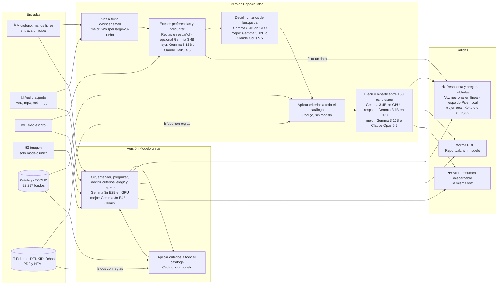
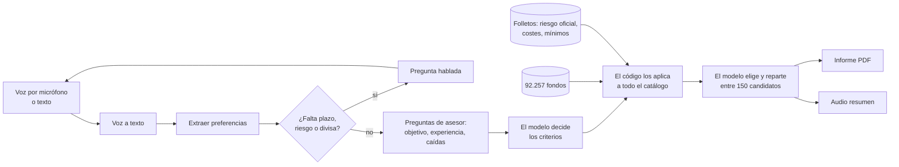

# FondoClaro · asesor de fondos por voz (MVP)

MVP del Taller B5-T4. El usuario **habla** con la página sobre lo que quiere invertir y la página le **responde con voz**. Si falta algún dato obligatorio, se lo pregunta. Al terminar entrega un **informe PDF** con la cartera de fondos propuesta y un **audio** que resume en qué le recomienda invertir. También se puede escribir en lugar de hablar.

Los modelos se descargan de Hugging Face y se ejecutan en local; no hace falta ninguna clave. La única parte que sale del equipo es la voz neuronal de las respuestas, que se puede desactivar (ver «Voz»).

> Demostración educativa. No es asesoramiento de inversión, no sustituye un test de idoneidad y no verifica comisiones ni mínimos de suscripción. Las rentabilidades pasadas no garantizan rentabilidades futuras.


Las capturas están hechas con el catálogo sintético de demostración (`CATALOG=demo`): los fondos y sus cifras son ficticios.

## Requisitos

| | Instalación básica (`instalar.bat`) | Con modelos de GPU (`instalar_parte2_opcional.bat`) |
| --- | --- | --- |
| Sistema | Windows 10 u 11 de 64 bits | El mismo |
| Python | 3.11, con el lanzador `py` (viene con el instalador de python.org) | El mismo |
| Procesador y memoria | Cualquier CPU reciente; 8 GB de RAM | 16 GB de RAM |
| Tarjeta gráfica | No hace falta | NVIDIA con 12 GB de memoria o más y controlador reciente (se instala PyTorch para CUDA 12.8) |
| Disco | 3 GB (entorno y 1,4 GB de modelos) | 24 GB más (PyTorch con CUDA y 19 GB de modelos) |
| Internet | Para instalar; después solo para la voz neuronal | Para instalar |
| Navegador | Chrome o Edge recientes, con permiso de micrófono | El mismo |
| Datos | `catalogo_fondos.md` y, opcionalmente, la carpeta `folletos/` (no están en el repositorio); sin catálogo se usan 10 fondos de ejemplo | Los mismos |

Con la instalación básica funciona toda la conversación por voz, el informe y el audio; los fondos los elige Gemma 3 1B en CPU entre 10 candidatos. La parte 2 añade el modelo que decide los criterios y elige entre 150 candidatos (Gemma 3 4B) y la página «Modelo único» (Gemma 3n).

## Arranque tras clonar (Windows)

1. Copia `catalogo_fondos.md` y, si la tienes, la carpeta `folletos/` (ninguno está en el repositorio) a la carpeta del proyecto. Sin el catálogo se usan 10 fondos sintéticos de ejemplo.
2. Doble clic en **`instalar.bat`**. Crea el entorno, instala las dependencias, descarga los modelos básicos (1,4 GB), importa el catálogo y procesa los folletos si los encuentra. Funciona en cualquier equipo, sin GPU.
3. Doble clic en **`iniciar.bat`**. Arranca la aplicación y abre `index.html`, la puerta de entrada con los enlaces.
4. Opcional, solo con una NVIDIA de 12 GB o más: doble clic en **`instalar_parte2_opcional.bat`**. Instala PyTorch con CUDA y descarga 19 GB de modelos. Añade el filtro con Gemma 3 4B y la versión de modelo único.

La aplicación queda en `http://localhost:8501`. Clona el proyecto en una ruta corta (por ejemplo `C:\proyectos\`): en rutas muy largas la instalación falla por el límite de Windows.

Para importar el catálogo más tarde: `.venv\Scripts\python scripts\import_catalog.py ruta\a\catalogo_fondos.md`.

A mano, sin los `.bat`:

```bash
py -3.11 -m venv .venv
.venv\Scripts\python -m pip install -r requirements.txt --only-binary=llama-cpp-python --extra-index-url https://abetlen.github.io/llama-cpp-python/whl/cpu
.venv\Scripts\python scripts\download_models.py
.venv\Scripts\python -m streamlit run app.py
```

En la página **Pruebas y estado** se ve qué está instalado y qué falta, y se pueden ejecutar las pruebas automáticas desde el navegador.

## Qué hay en la página

| Página | Qué es |
| --- | --- |
| 🧩 **Especialistas** | Un modelo adaptado a cada paso. En la barra lateral se elige quién selecciona los fondos (Gemma 3 4B en GPU, Gemma 3 1B en CPU, Claude por API o solo reglas; aparecen las opciones instaladas) y quién entiende lo que dices (reglas, o reglas más el modelo de lenguaje). |
| 🧠 **Modelo único** | Un solo modelo multimodal (Gemma 3n) recibe audio, texto o imagen y hace todo. Necesita GPU. |
| ✅ **Pruebas y estado** | Qué modelos y datos hay instalados, y las pruebas automáticas. |

Hay tres formas de conversar, que se eligen encima del micrófono:

- **🎧 Manos libres** (por defecto): se pulsa «Empezar conversación» una vez. La página habla, escucha hasta que te callas, envía sola y vuelve a escuchar cuando termina de responder. No oye mientras habla, así que no se la puede interrumpir.
- **🎙️ Pulsar para hablar:** pulsar, hablar y volver a pulsar para enviar.
- **⌨️ Escribir:** chat de texto, donde también se pueden adjuntar audios.

**Voz.** Las respuestas usan una voz neuronal en línea (`es-ES-ElviraNeural`, a través del paquete `edge-tts`), más natural que la local. Envía el texto de cada respuesta al servicio de voz de Microsoft y no es una API oficial. Con `VOICE=local` en `.env`, o sin conexión, se usa Piper y nada sale del equipo.

**Entender lo que dices.** Por defecto lo hacen unas reglas en español, instantáneas. Con «Reglas + modelo de lenguaje», Gemma 3 4B lee además cada frase. En una prueba con ocho frases coloquiales el modelo captó cosas que las reglas no («bolsa americana», importes en letra), pero tardó 8–13 s por turno, se equivocó en algún dato y rellenó rasgos que nadie había dicho; por eso solo se le toman plazo, riesgo, divisa, importe, zona y sector, y las reglas tienen la última palabra.

**Conversación de prueba:** «Quiero invertir 10.000 euros en fondos de tecnología, bien diversificado» → «A cinco años y con riesgo alto» → «Quiero hacer crecer el dinero, nunca he invertido y si cae vendería».

**Cambiar el aspecto:** `estilo.css` (burbujas, títulos) y `.streamlit/config.toml` (colores, tipografía, puerto). `index.html` es solo la portada con los enlaces; la aplicación es Python y no funciona abriendo un HTML sin arrancarla.

## Entradas, modelos y salidas

Cada cuadro indica, por este orden, el paso, el modelo instalado y el que creemos que funcionaría mejor (no probado aquí).



## Cómo funciona



1. **Conversación.** Son obligatorios el plazo (1, 3 o 5 años, los únicos con datos), el riesgo y la divisa. Lo que falte se pregunta por voz. Importe, zona, sector, clase de activo y grado de diversificación son opcionales.
2. **Preguntas de asesor.** Una vez, y se pueden saltar: objetivo (crecer, conservar, rentas), experiencia y reacción ante una caída del 20 %. Si las respuestas no sostienen el riesgo declarado, se baja un nivel y se explica.
3. **El modelo decide los criterios.** A partir de la conversación transcrita fija cuánto pesan el ajuste al riesgo, el Sharpe y la rentabilidad, la volatilidad objetivo, una rentabilidad mínima y, si el cliente pidió un tema («oro», «tecnología»), las palabras que deben aparecer en el nombre del fondo.
4. **El código los aplica a todo el catálogo.** Siempre se descartan los fondos de otra divisa, sin datos recientes o por encima de la volatilidad máxima del perfil (bajo 10 %, medio 20 %, alto 35 %): el modelo no puede subir el riesgo. Una ficha verificada que contradiga la preferencia no se sustituye por una coincidencia en el nombre. Se agrupan las posibles clases de participación por nombre, conservando números de índices y términos de cobertura; esta agrupación es aproximada.
5. **El modelo elige y reparte.** Ve los 150 mejores candidatos con sus cifras y devuelve qué fondos y con qué peso. Se respeta un número concreto solicitado de 1 a 7 fondos; «un solo fondo» recibe el 100 %. Si no se indica, se eligen entre 2 y 7 según la diversificación. Si faltan candidatos, se explica cuántos hay disponibles.
6. **Validación.** Solo se aceptan fondos de la lista y pesos numéricos finitos. Los repartos inválidos se sustituyen por uno basado en la inversa de la volatilidad. Tanto el modelo como las reglas respetan un mínimo del 5 % y un máximo del 60 % por fondo (80 % si hay dos; 100 % si solo hay uno). Si el modelo falla, deciden las reglas.
7. **Entrega.** PDF con la conversación, el perfil, los criterios, la cartera, un gráfico y el porqué de cada fondo; y un audio con el resumen. Los importes se asignan a céntimos conservando el total y los límites de concentración. Pantalla, PDF, audio y simulación utilizan ese mismo reparto; los porcentajes mostrados son aproximaciones a dos decimales.

Se reconocen importes en EUR, USD, GBP y CHF, con cifras o expresados en español («diez mil euros», «10.000 dólares», «ciento veinte euros con cincuenta céntimos»). Los importes negativos, nulos o no interpretables que se detecten requieren aclaración; no se transforman en cantidades positivas. Cuando se pregunta por el importe, se puede contestar solo con la cantidad. El importe sigue siendo opcional si no se ha indicado.

Los pasos 3 y 5 con 150 candidatos necesitan el filtro en GPU (o Claude). Con Gemma 3 1B en CPU no hay paso 3 y el modelo elige entre 10 candidatos.

### Límites que conviene conocer

- **Las cifras nunca salen del modelo.** Rentabilidades, volatilidades y motivos por fondo vienen del catálogo.
- **El modelo no lee los 92.257 fondos uno a uno.** No caben en su contexto: decide los criterios, el código los aplica a todos y el modelo elige entre los 150 mejores.
- **Zona y sector solo están verificados donde hay folleto.** Para el resto, las preferencias se comprueban con el nombre del fondo y el informe lo marca como «exposición no verificada».
- **La inversión mínima solo se conoce donde hay ficha** (unos 1.700 fondos); esos se descartan si el mínimo supera el importe. Para el resto, por debajo de 100.000 se prefiere, entre las clases de un mismo fondo, la que no parece institucional; el mínimo real hay que mirarlo en el folleto.
- **Las exclusiones por sector no se pueden garantizar** sin la composición completa; la app lo dice y pregunta si sigue sin ellas.
- **El reparto no es una optimización de cartera completa:** no hay correlaciones entre fondos.
- **Los modelos locales no consultan internet.** Solo usan lo que se les pasa.
- **En manos libres no se puede interrumpir a la página:** solo escucha cuando ha terminado de hablar.

## Folletos de los fondos

`scripts/procesar_folletos.py` convierte la documentación descargada (carpeta `folletos/` con su `indice.csv`) en una fila por fondo, en `data/private/folletos.csv`:

| Documento | Qué se extrae |
| --- | --- |
| DFI de la CNMV y KID (PRIIPs) | Riesgo oficial de 1 a 7, periodo recomendado, costes corrientes, categoría y objetivo |
| Ficha de Deutsche Bank | Inversión mínima, divisa y gastos corrientes |
| Folleto resumido de la SEC (497K) | Objetivo y gastos anuales |

Zona, sector y clase de activo se deducen del objetivo con palabras clave. Se hace con reglas, sin modelo: son miles de documentos y tarda alrededor de un minuto. En la primera pasada (17.000 documentos de 19.128 fondos) se obtuvo el riesgo oficial de 2.406 fondos, los costes de 14.419 y la inversión mínima de 1.686.

Cómo se usa en la recomendación:

- **Riesgo oficial:** se descarta el fondo si su clase de riesgo supera la del perfil (bajo hasta 3, medio hasta 4, alto hasta 6), aunque su volatilidad pasada quepa.
- **Inversión mínima:** se descarta si supera el importe que se quiere invertir.
- **Costes:** restan puntuación y se muestran al modelo, que los tiene en cuenta al elegir.
- **Zona, sector y activos:** lo que dice el folleto cuenta como exposición verificada.
- **Fondos que solo están en los folletos:** no tienen precios en el catálogo, así que no se pueden puntuar. Los que encajan por divisa, riesgo oficial y preferencias se listan aparte en la página y en el PDF.

La descarga sigue creciendo: el script solo lee los fondos nuevos o con documentos nuevos, e `iniciar.bat` lo ejecuta en cada arranque. El histórico de precios en Parquet, cuando esté, permitirá calcular las métricas de los fondos que hoy solo tienen folleto e incluirlos en el reparto; hoy no está integrado.

Los textos no se leen con un modelo de lenguaje ni con OCR: un documento escaneado o con una redacción distinta de la habitual se queda sin datos.

## Comparación entre versiones

| | Especialistas | Modelo único |
| --- | --- | --- |
| Voz a texto | Whisper `small` | Gemma 3n E2B |
| Entender la petición | Reglas en español | Gemma 3n E2B |
| Qué preguntar | Preguntas fijas | Gemma 3n E2B las redacta |
| Criterios, elección y reparto | Gemma 3 4B | Gemma 3n E2B |
| Hablar | Voz neuronal en línea o Piper | La misma (Gemma 3n no genera voz) |
| Memoria de GPU | 4 GB | 11 GB |

Las dos comparten catálogo, filtros, validación, PDF y voz, así que la diferencia que se observa es la de los modelos. Cada respuesta muestra los segundos que ha tardado. En la GPU solo hay un modelo cargado a la vez: al cambiar de versión, la primera respuesta tarda más.

**Primera comparación.** Es una sola conversación de tres turnos hablados, con audios generados por Piper y un micrófono simulado en el navegador; no es una evaluación.

- **Especialistas:** transcribió y extrajo bien los datos y entregó la propuesta en el tercer turno. Las preguntas tardan unos 3 s; la propuesta, 20–50 s (más la primera vez, al cargar el modelo).
- **Modelo único:** transcribió bien, pero no dedujo la divisa de «10.000 euros» y siguió preguntando, así que no llegó a la propuesta en tres turnos. Cada turno tarda unos 18 s. Sus preguntas suenan más naturales.

## Modelos candidatos por paso

En negrita, el instalado. Las alternativas no se han probado aquí.

| Paso | Instalado | Alternativa local | Alternativa en la nube |
| --- | --- | --- | --- |
| Voz a texto | **Whisper `small`** (CPU) | Whisper `large-v3-turbo`; NVIDIA Parakeet TDT v3 | `gpt-4o-transcribe` |
| Extraer preferencias | **Reglas en español** · opcional **Gemma 3 4B** (GPU) | Gemma 3 12B; Qwen 2.5 7B | Claude Haiku 4.5; Gemini Flash |
| Criterios, elección y reparto | **Gemma 3 4B en 4 bits** (GPU, 4 GB) · respaldo **Gemma 3 1B Q4** (CPU) | Gemma 3 12B; Qwen 2.5 14B | Claude Opus 5.5 (preparado, deshabilitado) |
| Texto a voz | **Voz neuronal `es-ES-ElviraNeural`** (en línea) · respaldo **Piper `es_ES-davefx-medium`** (CPU) | Kokoro; XTTS-v2 | ElevenLabs Multilingual; `gpt-4o-mini-tts` |
| Modelo único multimodal | **Gemma 3n E2B** (GPU, 11 GB) | Gemma 3n E4B; Phi-4 multimodal; Qwen2.5-Omni | Gemini; GPT-4o audio |
| Leer folletos, DFI y KID | **Reglas sobre el texto del PDF** (PyMuPDF, sin modelo) | Docling; Qwen2.5-VL para escaneados | Claude con PDF |

Para cambiar Whisper: `WHISPER_MODEL=medium` en `.env` y volver a ejecutar `scripts/download_models.py`.

### Claude y consulta web (deshabilitado)

El filtro también puede hacerlo Claude por API. Está preparado pero **no se ha probado**, porque no hay clave configurada. Para activarlo: `pip install -r requirements-claude.txt`, copiar `.env.example` a `.env` y poner `ANTHROPIC_API_KEY`; entonces aparece «Claude por API» en la barra lateral. Con `ADVISOR_WEB=on` Claude puede además buscar en la web datos públicos de los candidatos (categoría, zona, comisiones). Consume tokens de pago y envía al proveedor la conversación y la lista de candidatos; `.env` está ignorado por Git.

## Estructura

```text
instalar.bat, iniciar.bat  Instalación y arranque con doble clic
instalar_parte2_opcional.bat  Modelos de GPU, opcional
index.html                 Portada con los enlaces a la aplicación
app.py                     Punto de entrada y navegación
paginas/                   Especialistas, Modelo único, Pruebas y estado
estilo.css, .streamlit/    Aspecto y configuración de la página
src/conversation.py        Diálogo: qué falta, qué preguntar, ajuste de riesgo
src/preferences.py         Reglas de extracción en español
src/audio.py               Voz a texto (Whisper)
src/tts.py                 Texto a voz (voz neuronal en línea y Piper)
src/extraction.py          Extracción de preferencias con modelo de lenguaje
componentes/manos_libres/  Micrófono manos libres (HTML y JavaScript)
src/recommender.py         Filtros, puntuación, clases de un mismo fondo
src/ai_filter.py           Criterios, selección y reparto con IA (Gemma o Claude)
src/omni.py                Lo mismo con Gemma 3n como único modelo
src/hf_model.py            Carga de modelos en la GPU, uno a la vez
src/report.py              Informe PDF y texto del resumen hablado
src/ui.py                  Piezas de interfaz comunes a las dos versiones
scripts/download_models.py Descarga de modelos desde Hugging Face
scripts/import_catalog.py  Conversión del Markdown EODHD a CSV
scripts/procesar_folletos.py  Lectura de DFI, KID y fichas a una fila por fondo
src/brochures.py           Uso de esa documentación en la recomendación
data/demo_funds.csv        Catálogo sintético
data/private/, models/     Catálogo real y modelos, ignorados por Git
tests/                     Pruebas (python -m unittest discover -s tests)
```

El dataset EODHD y sus derechos de uso no se incluyen en el repositorio; no lo publiques sin comprobar la licencia. Gemma se distribuye bajo los términos de uso de Google y Piper (`piper-tts`) bajo GPL-3.0.
