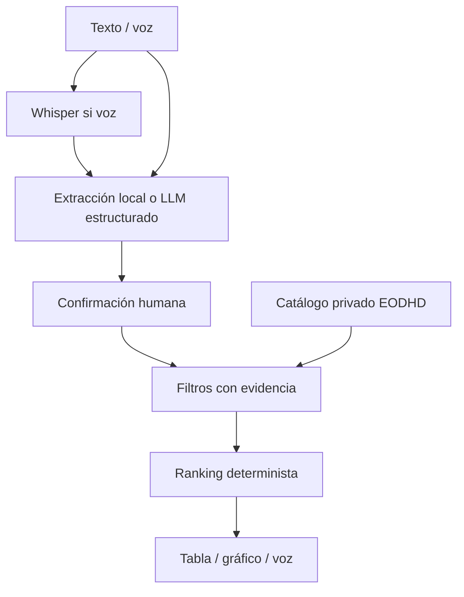

# Pitch técnico · FondoClaro

## Una idea en 30 segundos

**Problema:** elegir entre miles de clases de fondos exige traducir una necesidad cotidiana en filtros técnicos, identificar qué datos están verificados y explicar la decisión sin esconder incertidumbre.

**Producto:** una aplicación que entiende una petición escrita o hablada, pide confirmar los datos esenciales y devuelve una preselección con cifras históricas, fuentes y razones visibles. La voz, el texto, el gráfico y el resumen hablado cumplen funciones distintas del mismo flujo.

**Usuario inicial:** estudiantes de finanzas y profesionales en fase de exploración. Un canal B2B2C con asesores regulados sería una evolución, no una capacidad actual.

## Demo de 90 segundos

1. Arranca `streamlit run app.py` y enseña el aviso de catálogo sintético.
2. Escribe: «Quiero invertir 10.000 euros a 5 años, con riesgo medio, en un fondo global».
3. Pulsa *Interpretar petición*. Explica que el usuario confirma plazo, riesgo y moneda antes de recomendar.
4. Pulsa *Obtener propuesta*. Enseña tabla, gráfico, razones e ISIN/ID de ejemplo. Escucha el resumen.
5. Prueba «sin tecnología»: el sistema se abstiene porque no puede garantizar la exclusión con la composición parcial.
6. Muestra la opción de audio y explica el módulo Whisper local. Si se dispone del modelo, transcribe la petición en vivo.

## Diferencia frente a una lista de rentabilidad

El ranking exige datos recientes, respeta la divisa y un límite de volatilidad elegido por el usuario, y no utiliza regiones o sectores sin fuente asociada. La interpretación mediante LLM es optativa; no delegamos al modelo la puntuación financiera. El usuario puede revisar lo que entendió el sistema.

## Ingeniería y evolución

**Siguiente iteración:** incorporación de folletos y documentos de datos fundamentales mediante extracción visual/OCR, verificación de composición completa y costes reales; control de clases equivalentes; evaluación con peticiones etiquetadas; pruebas de latencia y seguridad; asesoramiento legal sobre idoneidad. Estas funciones no se atribuyen al MVP actual.

**Economía:** demo local sin coste de API; la transcripción local consume CPU; la extracción LLM opcional se factura por tokens. Un posible ingreso futuro es licencia B2B2C, sujeto a controles y autorizaciones regulatorias.
