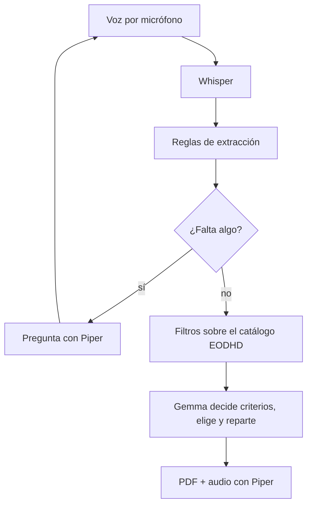

# Pitch técnico · FondoClaro

## Una idea en 30 segundos

**Problema:** elegir entre miles de clases de fondos exige traducir una necesidad cotidiana en filtros técnicos y explicar la decisión sin esconder la incertidumbre.

**Producto:** una página con la que se conversa por voz o texto. Pregunta en voz alta lo que le falta, hace las preguntas que haría un asesor y entrega un informe PDF con una cartera de fondos y un audio que la resume. Todo con modelos locales.

**Usuario inicial:** estudiantes de finanzas y profesionales en fase de exploración. Un canal B2B2C con asesores regulados sería una evolución, no una capacidad actual.

## Demo de 2 minutos

1. Doble clic en `iniciar.bat` (o `streamlit run app.py`).
2. Di o escribe: «Quiero invertir 10.000 euros en fondos de tecnología, bien diversificado». La página pregunta en voz alta por el plazo y el riesgo.
3. Responde: «A cinco años y riesgo alto». Pregunta por objetivo, experiencia y reacción ante caídas.
4. Responde: «Quiero hacer crecer el dinero, nunca he invertido y si cae vendería». Baja el riesgo a medio, lo explica y propone la cartera.
5. Escucha el resumen y descarga el PDF.
6. Repite la conversación en la página «Modelo único» y compara tiempos y errores.

## Qué lo diferencia de una lista de rentabilidades

- Las cifras salen siempre del catálogo, nunca del modelo de lenguaje.
- La IA elige y reparte solo entre fondos que ya cumplen divisa, datos recientes y límite de volatilidad, y su respuesta se valida.
- Comprueba la coherencia del perfil: si las respuestas no sostienen el riesgo declarado, lo baja y lo dice.
- Marca lo que no está verificado (zona y sector por nombre, mínimos de suscripción).

## Ingeniería

La versión alternativa sustituye Whisper, las reglas, las preguntas y Gemma 3 4B por un único Gemma 3n. Ver la comparación en el README.

La presentación de cinco diapositivas está en `docs/pitch_fondoclaro_v3.pptx`; el esquema del problema, la viabilidad, la normativa y la monetización, en el README.

**Siguiente iteración:** composición y costes reales desde folletos y KID, mínimos de suscripción, correlaciones para optimizar el reparto, evaluación con peticiones etiquetadas, revisión legal de idoneidad.

**Economía:** sin coste de API. La instalación básica corre en CPU; el filtro con Gemma 3 4B y la versión de modelo único necesitan GPU. Claude por API está preparado como alternativa de pago y deshabilitado.
